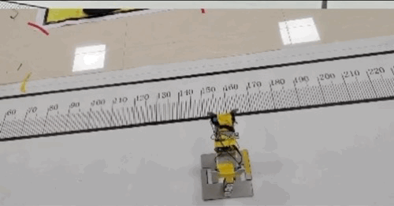
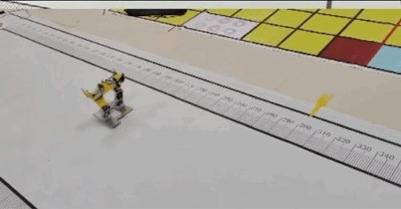
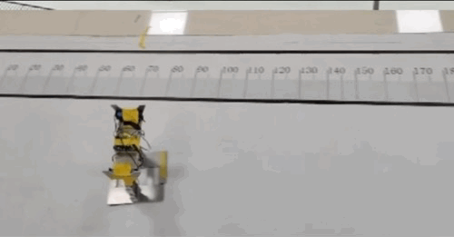
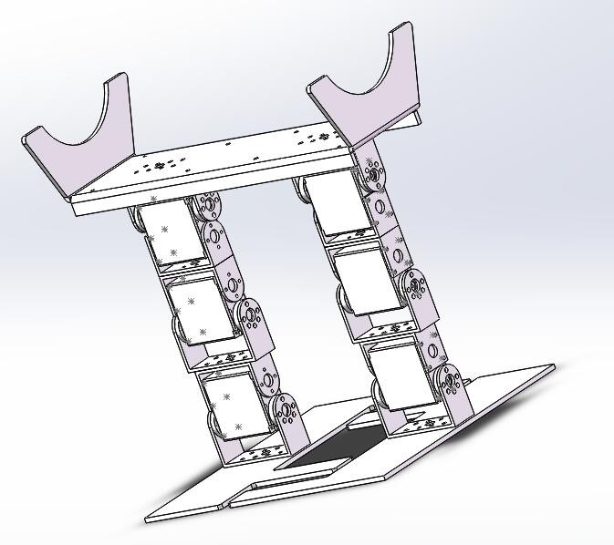
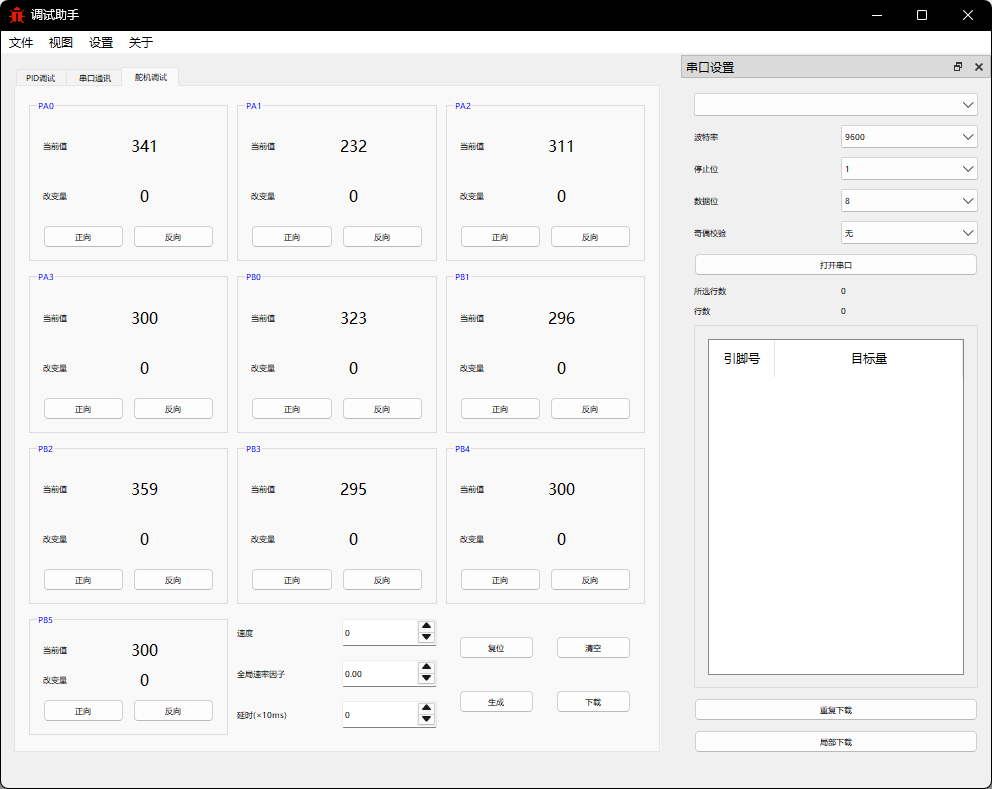

# Biped-Walking-Robot-Project

This repository documents the design of a 6-DOF biped race-walking robot, originally developed for the China Engineering Robot and International Open Competition. This project showcases the complete engineering workflow, from mechanical structure to hardware design and the software control architecture.

Note: This repository is focused on open-sourcing the hardware. 

## Core Function Demonstration
This robot was designed to complete a complex race course, requiring stable walking and full-body tumbling. The three core movements are:

This robot was designed to complete a complex race course, requiring stable walking and full-body tumbling. The three core movement modes are:

| Short-Stride Gait | Long-Stride Gait | Tumbling |
| :---: | :---: | :---: |
|  |  |  |

## Mechanical Structure
The robot is a 6-DOF bipedal platform, with each leg having 3 degrees of freedom (hip, knee, and ankle). This configuration allows for complex movements like walking, turning, and tumbling.

* **Design:** The entire structure was modeled in SolidWorks.
* **Materials:** To balance weight and strength, the main structural components (footplates, shoulder plates) are made of **6061 Aluminum Alloy**, while the U-shaped connectors are made from 2mm hard aluminum.
  

  

## Hardware Design

The hardware system I designed is centered around the **ATmega16 ** microcontroller and is built on a custom-designed PCB.

A key part of the design is the power system. To maximize torque, the six **LDX-218 servos** are powered directly from a **7.4V** (2x 18650 Li-ion) rail. A separate **5V** logic rail for the ATmega16 and other components is created using an **AMS1117-5.0** voltage regulator. This separation ensures the high current draw from the servos does not cause a brownout or reset the microcontroller.

| Component | Specification |
| :--- | :--- |
| **Control MCU** | 1x ATmega16 (AVR) |
| **Actuators** | 6x LDX-218 Servos |
| **Power Supply** | 2x 18650 Li-ion Batteries (7.4V) |
| **Voltage Regulator**| AMS1117-5.0 | 

## Software Design

The firmware is written in **C** for the **ATmega16** microcontroller. It is designed for high-precision, real-time control of all six joints.

* **Software PWM Control:** The core of the firmware uses **Timer1** (Overflow and Compare Match interrupts) to generate 6 independent, high-resolution PWM signals entirely in software. This allows precise angle control for all servos without relying on limited hardware PWM channels.
* **Motion Interpolation:** A smooth motion loop moves each servo from its `current_value` to the `target` value at a calculated `pspeed`. This ensures all joint movements are synchronized and smooth, rather than sudden.
* **Gait Execution:** In `RUN` mode, the firmware executes pre-defined action groups (gait data) stored in the `workdata` array. It parses this array for target angles, speeds, and delays to perform complex sequences like walking or tumbling.
* **Debug & Communication:** A `DEBUG` mode is included, which uses the **UART** serial interface (9600 baud) to receive commands from a PC-side application, allowing for live testing and calibration of servo positions.

The image below shows the PC host application used for debugging the robot.

  
